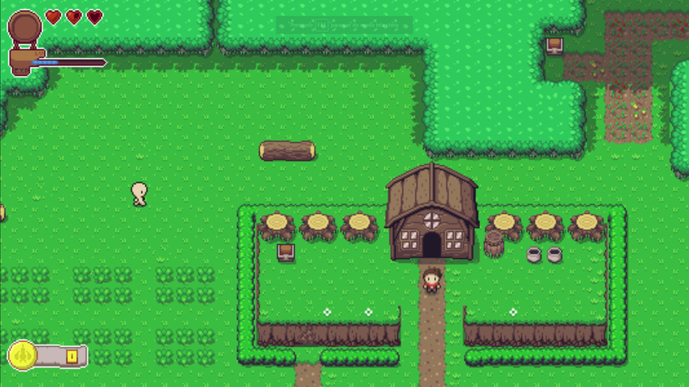

# Exemplo de Game TopDown com JavaScript



## Descrição
Breve descrição do seu projeto: o que ele faz e por que foi desenvolvido.

## Instalação
Clone o repositório:
```bash
https://github.com/MatheusBrandao525/TopDownGame.git

// Entre na pasta do projeto
cd TopDownGame

// Instale as dependências
npm install

// Inicie o servidor
node app.js
```

# Iformações adicionais
Este projeto foi criado por [mcline86](https://github.com/mcline86) a atualizado por [MatheusBrandao525](https://github.com/MatheusBrandao525)

## Contribuições
Qualquer contribuição para melhoria do projeto é bem-vinda!
